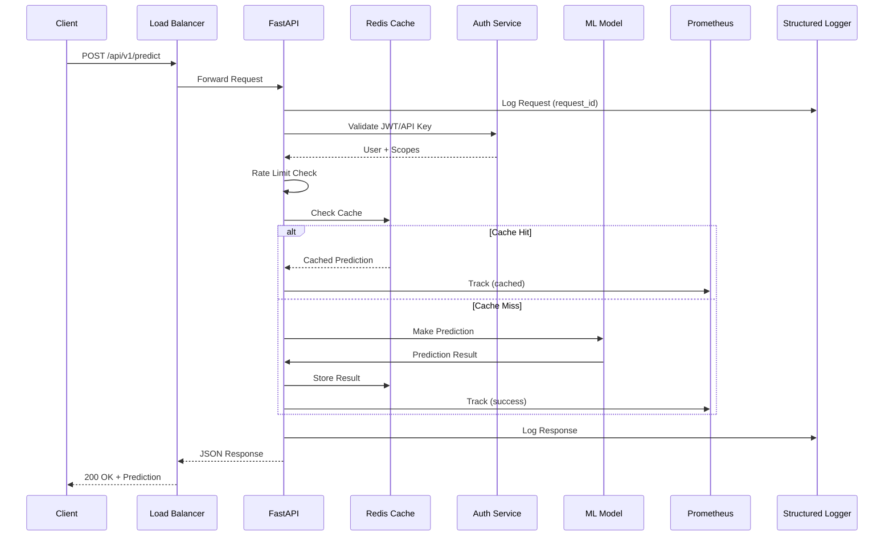
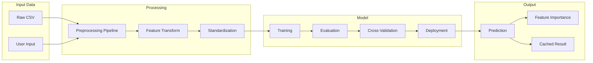
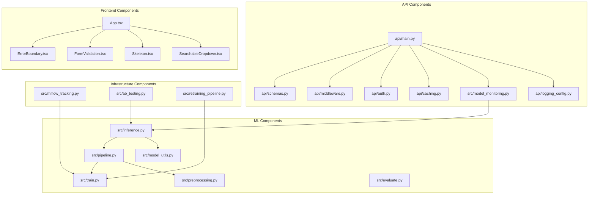
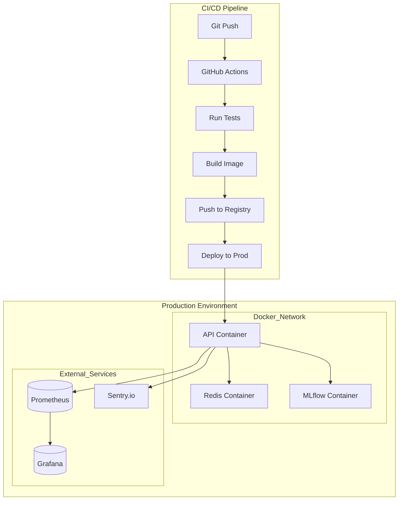
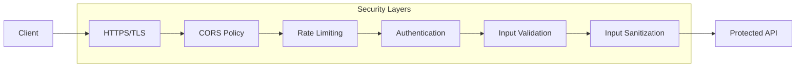
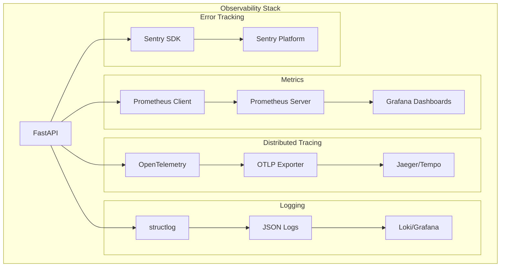

# Architecture Diagram

## System Overview

```mermaid
graph TB
    subgraph Clients
        Web[Web Browser]
        API_Client[API Clients]
        Mobile[Mobile App]
    end

    subgraph Frontend["Frontend Layer"]
        React[React + TypeScript]
        Vite[Vite Build]
        EB[Error Boundaries]
        FV[Form Validation]
        LS[Loading States]
    end

    subgraph APILayer["API Layer (FastAPI)"]
        FastAPI[FastAPI Application]

        subgraph Middleware
            RL[Rate Limiting]
            AUTH[Authentication]
            CORS[CORS]
            LOG[Request Logging]
            SEC[Security Headers]
        end

        subgraph Endpoints
            Health[Health Check]
            Predict[/predict]
            BatchPredict[/predict/batch]
            Explain[/predict/explain]
            ModelInfo[/model/*]
        end

        subgraph Monitoring
            Prom[Prometheus Metrics]
            Trace[OpenTelemetry Tracing]
            Sentry[Sentry Error Tracking]
        end
    end

    subgraph MLService["ML Services"]
        Model[Scikit-learn Model]
        Pipeline[Preprocessing Pipeline]
        Features[Feature Engineering]
        Cache[Prediction Cache]
    end

    subgraph Infrastructure["Infrastructure"]
        Redis[(Redis Cache)]
        MLFlow[(MLflow Tracking)]
        FileStorage[(Model Storage)]
    end

    subgraph DataLayer["Data Layer"]
        CSV[(CSV Dataset)]
        Logs[(Prediction Logs)]
        Monitor[(Monitoring DB)]
    end

    subgraph DevOps["DevOps"]
        Docker[Docker]
        CI[GitHub Actions]
        Test[pytest]
        Lint[Ruff + mypy]
    end

    %% Connections
    Web -->|HTTPS| React
    Mobile -->|HTTPS| FastAPI
    API_Client -->|HTTPS| FastAPI

    React -->|Fetch API| FastAPI

    FastAPI --> RL
    FastAPI --> AUTH
    FastAPI --> CORS
    FastAPI --> LOG
    FastAPI --> SEC

    RL --> Endpoints
    AUTH --> Endpoints

    Predict --> Model
    BatchPredict --> Model
    Explain --> Model

    Model --> Pipeline
    Model --> Features
    Model --> Cache

    Cache --> Redis
    Predict -->|Log| Logs
    FastAPI --> Prom
    FastAPI --> Trace
    FastAPI --> Sentry

    Model -->|Load/Save| FileStorage
    MLService -->|Track| MLFlow

    Pipeline --> CSV
    Monitor -->|Drift Detection| MLService

    CI --> Test
    CI --> Lint
    Docker --> FastAPI
```

## Request Flow



## Data Flow



## Component Architecture



## Deployment Architecture



## Security Layers



## Monitoring Stack


